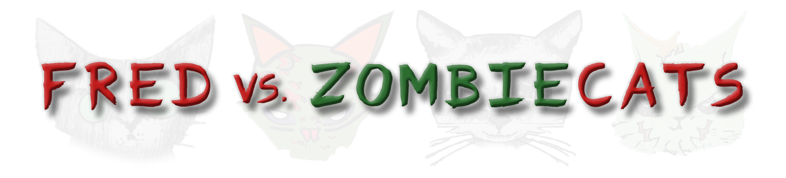

# Fred vs ZombieCats

Fred vs. ZombieCats is a thrilling game where you play as Fred, the town's last hope against flesh-eating zombie cats. The game was created by a team of three full-stack developers using React. All the game's images were generated using AI Stable Diffusion.

## Play the Game 
https://fred-vs-zombie-cats.vercel.app/

## Team Members
- Pavel Serebrennikov ([@SerebrennikovP](https://github.com/SerebrennikovP)) - *Game, Design, Management*
- Shlomo Zion ([@shlomozion](https://github.com/shlomozion)) - *Homepage*
- Sem ([@Bumbox](https://github.com/Bumbox)) - *Backend, Scoreboard, DeathPage*

## Music
The game features music from the Artlist.io library, providing an immersive audio experience.

## Gameplay
In Pleasantville, a catastrophic experiment at a local lab unleashed a virus, turning cats into flesh-eating zombies. Fred, an animal lover, becomes the town's last hope armed with enchanted hearts. He captures infected cats, using the hearts to heal them.

## How to Play
- The game is designed for desktop.
- Use the "Space" key to shoot hearts and heal infected cats.
- Use the "ArrowLeft" and "ArrowRight" keys to move Fred to different positions.
- Aim to heal as many cats as possible while avoiding attacks from the zombie cats.
- Stay alive and save the town from the zombie cat apocalypse!

Enjoy the game and have fun playing Fred vs ZombieCats!

# [Play the Game](https://fred-vs-zombie-cats.vercel.app/)
